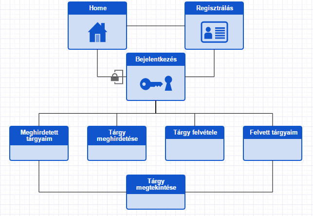

# Tantárgyfelvétel

## Dokumentáció

### Követelményanalízis

#### 1. Funkcionális elvárások

Alapvető követelmény egy webes felület megvalósítása tantárgyak meghirdetésére és felvételére. A felületnek rendelkeznie kell a következő funkciókkal:

* Autentikáció:
A felületre felhasználó nélkül ne lehessen belépni. A felület adjon lehetőséget a regisztrációra.
* Autorizáció:
A felhasználóknak két csoportját különböztetjük meg: tanár és diák. Tárgyat meghirdetni és törölni csak tanár tud, felvenni és leadni pedig csak diák. A felületnek biztosítania kell, hogy a felhasználó csak a szerepkörébe tartozó funkciókat érje el.
* Tantárgyak meghirdetése:
Egy tanár meghirdethet egy tárgyat.
* Tantárgyak törlése:
Egy tanár törölheti az általa meghirdetett tárgyakat.
* Meghirdetett tárgyak listázása:
Egy tanár lekérdezheti az általa meghirdetett tárgyakat
* Tantárgyak felvétele:
Egy diák felvehet egy meghirdetett tárgyat.
* Tantárgyak leadása:
Egy diák leadhat egy általa felvett tárgyat.
* Felvett tárgyak listázása:
Egy diák lekérdezheti az általa felvett tárgyakat.

#### 2. Nem funkcionális követelmények

* Jelenjen meg és működjön ugyanúgy minden elterjedtebb böngészőben
* Legyen intuitív a felhasználói felület
* Legyen könnyen kezelhető

#### 3. Használatieset-modell
    
Szerepkörök:

* Tanár:
Tantárgyakat hoz létre és töröl
* Diák:
Tantárgyakat vesz fel és ad le

Használati eset diagram:

Egy folyamat pontos menete:

1. Diák bejelentkezik
2. A felület felső menüjében megjelennek a diák számára elérhető funkciók
3. Diák kiválasztja a Tantárgy felvétele funkciót
4. A felületen megjelenik a meghirdetett tárgyak listája
5. Diák felveszi az egyik tantárgyat
6. Diák kiválasztja a Felvett tárgyaim funkciót
7. A felület megjeleníti az előbb felvett tantárgyat a listában

### Tervezés

#### 1. Architektúra terv

1. Komponensdiagram

2. Oldaltérkép

#### 2. Osztálymodell

1. Adatmodell

2. Adatbázisterv

3. Állapotdiagram

### Felhasználói dokumentáció

#### 1. A futtatáshoz ajánlott hardver-, szoftver konfiguráció

Minimum rendszerkövetelmények:

* Windows XP Service Pack 2+, Windows Vista, Windows 7, Windows 8 vagy Windows 10
* Intel Pentium 4 processzor vagy jobb
* legalább 512MB RAM

Ajánlott böngészők:

* Internet Explorer 9+
* Google Chrome - legfrissebb verzió
* Mozilla Firefox - legfrissebb verzió
* Apple Safari 5+

#### 2. Telepítés lépései: hogyan kerül a Githubról a célgépre a program

Az alkalmazás a Heroku platformon lesz közzétéve.

1. Regisztrálj a Heroku-n.
2. A következő lépéseket Cloud9 vagy Git parancssorában kell kiadni: 
    - heroku create \<alkalmazás neve\> --region eu
    - git push heroku master
Az alkalmazás a \<alkalmazás neve\>.herokuapp.com címen érhető el.

#### 3. A program használata

A programot a közzététel után a \<alkalmazás neve\>.herokuapp.com címen lehet elérni.
